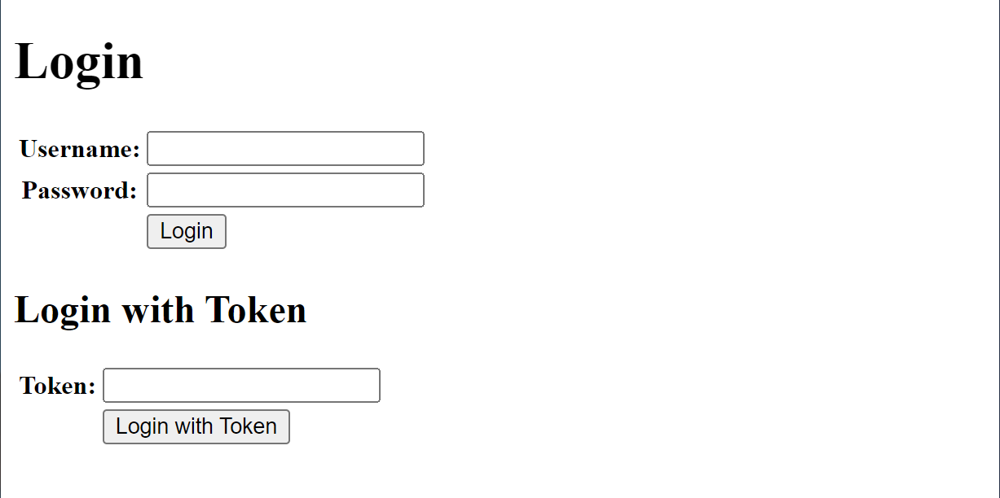
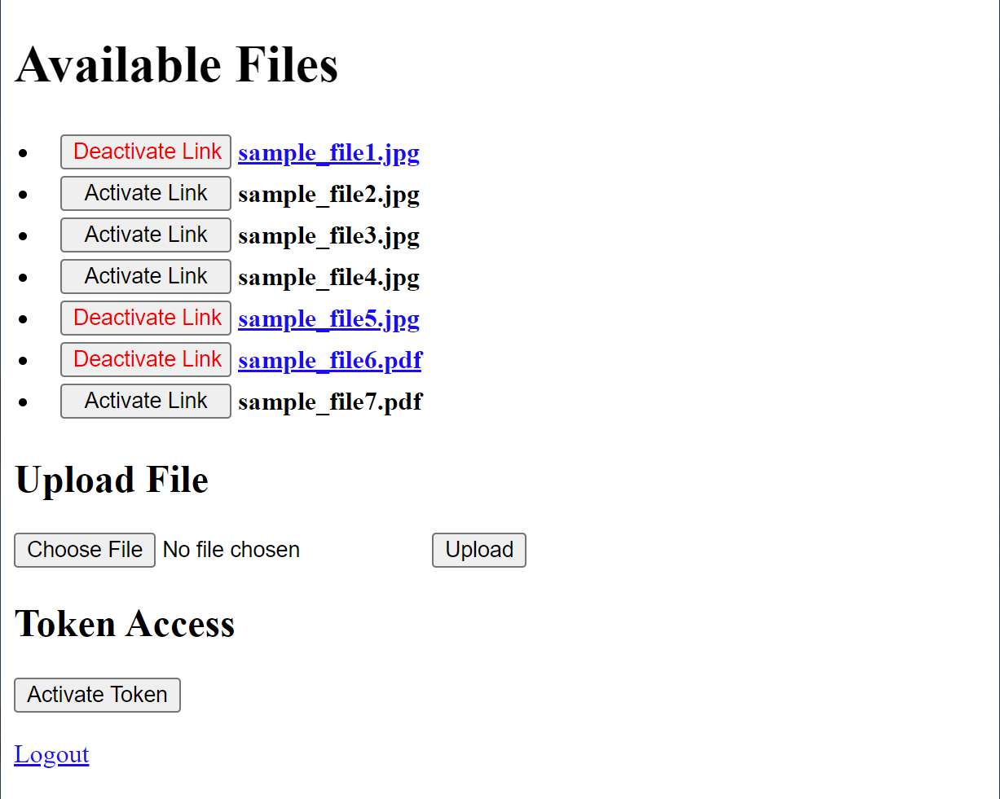
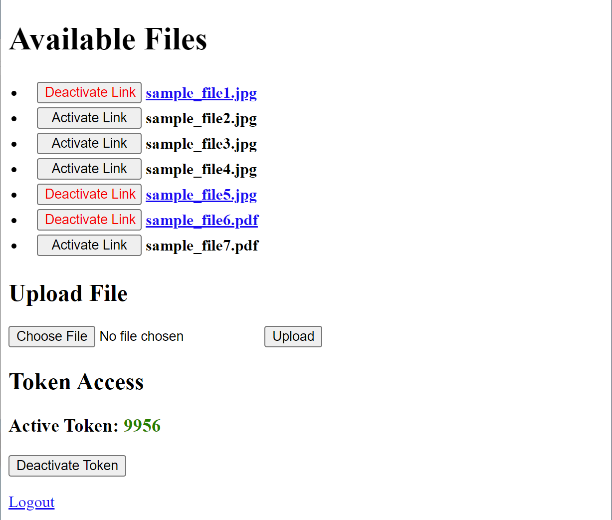
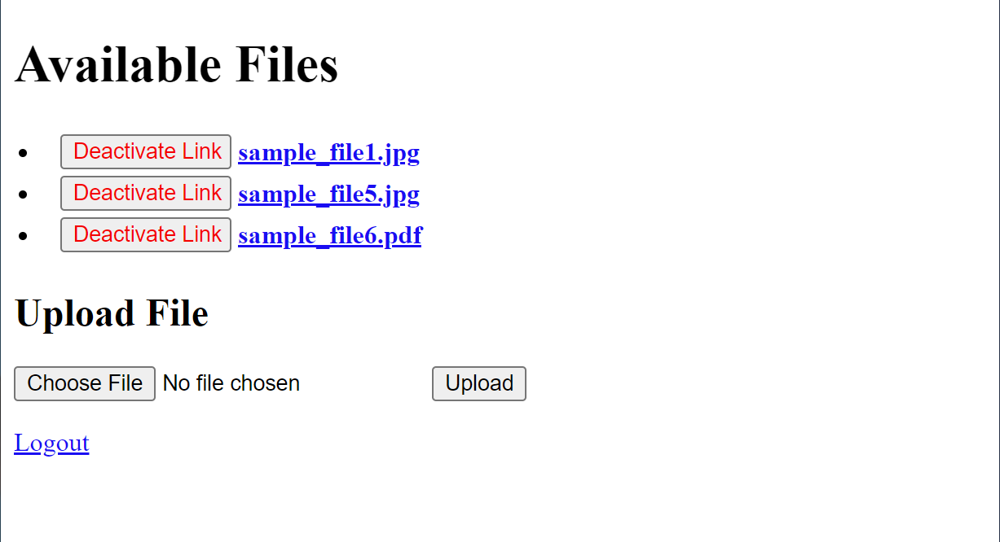

# HTTP File hosting

This project contains code of file server which makes it possible to upload and share files between users. At this time there is place for only one user account. User can manage uploaded files, generate links for them, or generate one-time access token for a guest user. A guest user can list, download and manage only the files that have been marked as public by admin. Files uploaded by guest user are automatically marked as public.

Here are some screenshots of how this app works:

Figure 1.: Login page of files app.

Figure 2.: Logged in user gets this page. They can activate or deactivate links for certain files, upload new ones and generate temporary access tokens.

Figure 3.: Here the same page, but with active token.

Figure 4.: Page seen by guest user (logged in by token). They can see only files with public access. Any uploaded file will automatically get its active link.

## How to run

1. Clone repository.
2. Create persistent volume directory:

   `mkdir -p /persistent_volumes/file_server/storage`

3. Ensure the `src/apptools` symlink points at the sibling `apptools` repository:

   `ln -s /repositories/apptools /repositories/file_server/src/apptools`

4. Review and adjust [.env](/repositories/file_server/.env).
5. Start the server:

   `docker compose up -d --build`

The app will be available on port `30006`.

The application code is built into the container image. `apptools/src` is pulled in during build through the `src/apptools` symlink, so inside the container the relevant paths are `./server.py` and `./apptools/src/...`. No `apptools` runtime mount is used. The only runtime path that remains mounted is:

- `/persistent_volumes/file_server/storage` -> `/server/storage`

## How to use

### General purpose

This simple file hosting application has been implemented to facilitate file transfer. At this moment it operates with one user (admin) only. Later, multiuser feature may be added.

### Admin page

On login page there is a form for providing username and password for only one user. Their credentials are loaded from environment variables. An admin can upload and download available files.

It is also possible to generate single-use tokens to occasionally allow others to download or upload admin's files.

### Guest page

Guest page is obtained by logging with token generated by admin. A guest can upload and download files, the same as admin. However they cannot generate any tokens.
