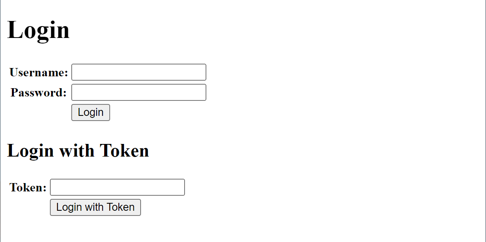

# HTTP File hosting

This project contains code of file server  which brings the posibility to upload and share files between users. At this time there is place for only one user account predefined in k8s secrets file. User can manage uploaded files, generate links for them (thus making certain files publickly accessed) or generate     one time access token for a guest user. A guest user can list , download and manage only the files that have been marked as public by admin. Files uploaded by guest user are automatically marked as public.

Here are some screenshots of how this apps work:


Figure 1.: Login page of files app.


Figure 2.: Logged in user gets this page. They can activate or deactivate links for certain files,  upload new ones and generate temporary access tokens.


Figure 3.: Here the same page, but with active token.


Figure 4.: Page seen by guest user (logged in by token). They can see only files with public access (links can be copied, opened, shared etc.). Any uploaded file will automatically get it's active link.

## How to run

1. Clone repository

### Development

2. Create `file_server_secrets_setup.sh` file:

   ```
   export APP_KEY='<app_key>'
   export USERNAME='<username>'
   export PASSWORD='<test>'
   ```
3. Run `source file_server_secrets_setup.sh`
4. Run development sever:

   ```
   cd src
   python server.py
   ```

### Kubernetes

2. Create `file_server_secrets.yaml` file:

   ```
   apiVersion: v1
   kind: Secret
   metadata:
      name: file-server-secret
   type: Opaque
   data:
      APP_KEY: <app_key_in_base64>
      USERNAME: <username_in_base64>
      PASSWORD: <password_in_base64>
   ```
3. Create persistent volume directory:

   `mkdir -p /persistent_volumes/file_server/storage`
4. Create version file:

   `echo '1.0.0' > version`
5. Build, tag and push image to repository for kubernetes:

   `make prod`

   After executing command above, new branch `release/X.Y.Z` will be added.
   Release branches store code state at any given release, so it can be retrieved
   if needed.
6. Apply kubernetes elements:

   ```
   kubectl apply -f file_server_secrets.yaml
   kubectl apply -f file_server_persistentvolume.yaml
   kubectl apply -f file_server_persistentvolumeclaim.yaml
   kubectl apply -f file_server_service.yaml
   kubectl apply -f file_server_deployment.yaml
   ```

### Docker

2. Add to `Dockerfile` lines:

   ```
   ENV APP_KEY='<app_key_in_base64>'
   ENV USERNAME='<username_in_base64>'
   ENV PASSWORD='<password_in_base64>'
   ```
3. Run:

   ```
   make build
   make run
   ```

## How to use

### General purpose

This simple file hosting application has been implemented to facilitate file transfer. At this moment it operates with one user (admin) only. Later, multiuser feature may be added.

### Admin page

On login page there is a form for providing username and password for only one user. Their credentials are specified in src/credentials file. An admin can upload and download available files.

It is also possible to generate single-use tokens to ocasionally allow others to download or upload admin's files.

### Guest page

Guest page is obtained by logging with token generated by admin. A guest can upload and download files, the same as admin. However they cannot generate any tokens.
